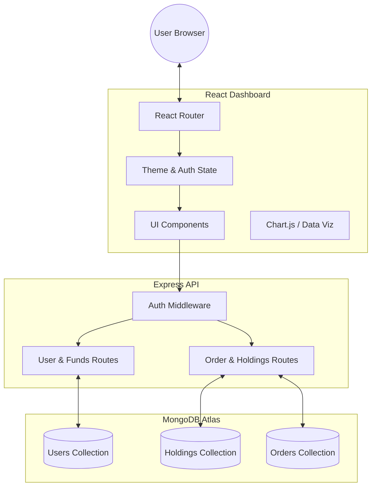

# 📈 Tradoza: Zerodha MERN Trading Ecosystem

Tradoza is a high-performance, full-stack trading dashboard clone of Zerodha, built using the MERN stack. It features a professional-grade "Midnight Pro" dark theme, real-time portfolio management, and a robust funds simulation system.


## 🚀 Key Features

- **🌙 Midnight Pro Dark Mode**: A premium, high-contrast black and neon interface designed for professional trading focus.
- **💰 Funds & Wallet System**: Fully functional Add/Withdraw funds logic integrated with portfolio buying power.
- **📊 Real-time Hybrid Portfolio**: Combines system-default "Market" data with individual user buy/sell actions.
- **📥 Seeding System**: One-click "Seed Data" to instantly populate empty accounts with market samples.
- **📱 Trading Ecosystem (Apps)**: A dedicated hub for tools like Console, Kite, Coin, and Varsity with a premium UI.
- **🥧 Dynamic Data Viz**: Integrated Doughnut and Vertical charts for asset distribution and price analysis.

## 🛠️ Technology Stack

- **Frontend**: React.js, Chart.js, Axios, React Router
- **Backend**: Node.js, Express.js
- **Database**: MongoDB (Mongoose ODM)
- **Security**: JWT (JSON Web Tokens), Bcryptjs Password Hashing
- **Styling**: Vanilla CSS with dynamic CSS Variables (Midnight Pro)

## 🏗️ System Architecture



## 📂 Project Structure

```text
Zeroda-MERN/
├── Backend/            # Express API Server
│   ├── model/          # Mongoose Models
│   ├── routes/         # API Endpoints (Auth, Funds, Orders)
│   ├── middleware/     # JWT Auth Logic
│   └── index.js        # Main Entry Point
├── dashboard/          # React Dashboard (Internal App)
│   ├── src/components/ # UI Components (Funds, Apps, Summary)
│   └── index.css       # Midnight Pro & Design System
└── frontend/           # Landing Page & Marketing Site
```

## 🔧 Installation & Setup

1. **Clone the Repo**
   ```bash
   git clone https://github.com/ayanhakeem/Tradoza.git
   ```

2. **Backend Setup**
   - Navigate to `Backend/`
   - Create a `.env` file with:
     ```env
     MONGO_URL=your_mongodb_uri
     JWT_SECRET=your_jwt_secret
     PORT=3002
     ```
   - Run `npm install` and `npm start`

3. **Dashboard Setup**
   - Navigate to `dashboard/`
   - Run `npm install` and `npm start` (Runs on Port 3003)

4. **Frontend Setup**
   - Navigate to `frontend/`
   - Run `npm install` and `npm start` (Runs on Port 3000)

## ⚠️ Security Note
This project uses `.env` files for configuration. Ensure your local `.env` is never committed to version control.

---
**Created with ❤️ by Ayannn!**
